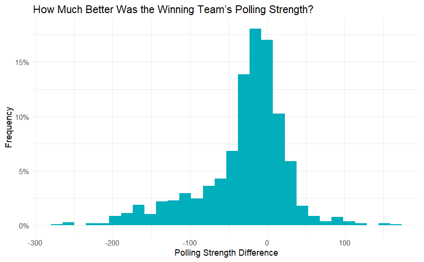
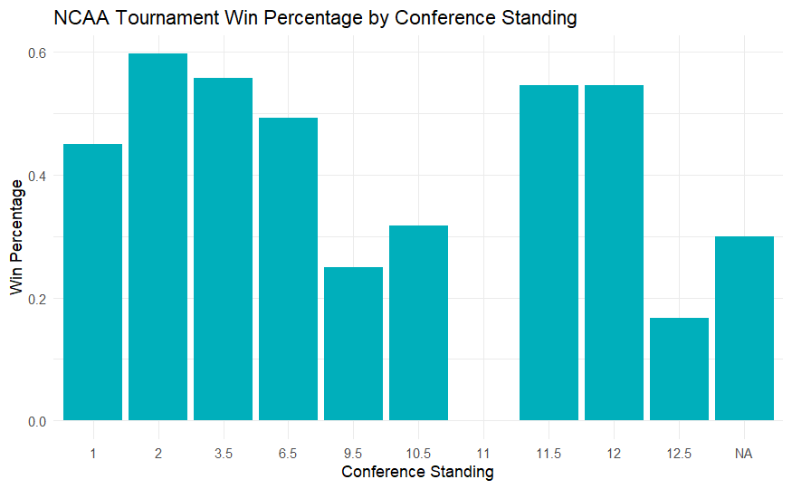

### Abstract/Executive Summary

Using the popular NCAA basketball tournament, March Madness, we attempt
to create an algorithm to predict the winner of each game. We use data
from the 2005 to 2021 seasons, located on Kaggle. We choose the XGBoost
algorithm due to its great predictive ability while still maintaining
some level of variable interpretability. Using 5-fold cross validation
to obtain out-of-sample performance metrics, the model scores an AUC of
0.773 and an accuracy of 70.3%, showing moderately strong predictive
ability given the unpredictable nature of March Madness games. We find
the most influential variable to be the difference in strength among the
two competing teams, where strength is calculated from the aggregation
of numerous polling rankings.

### A: Data and Problem Description

March Madness is an annual college basketball tournament that features
64 to 68 of the best teams in the country competing to win the NCAA
championship. The basketball tournament is highly watched and followed
by sports fans who fill out brackets and try to predict the winners of
all 63 to 67 games (the rules have changed over the years allowing for
either 64 or 68 teams). According to
[boydsbets.com](https://www.boydsbets.com/many-people-fill-brackets/###:~:text=According%20to%20the%20American%20Gaming,the%20conservative%20side%20of%20things.),
70 million brackets are created per year by fans attempting to fill out
a perfect bracket. However, there are 9.2 quintillion possible
combinations for brackets making this feat extremely challenging. It is
nearly impossible to correctly predict every game, but the goal is to
try to come as close as possible. This is a binary classification
problem because the tournament has only two outcomes for every game: a
win and a loss, and our goal is to predict which team wins a given
matchup.

The data comes from:
<https://www.kaggle.com/competitions/mens-march-mania-2022>. While there
is data from as far back as 1985, for the purposes of this project, only
data from 2005 and onward is used. This is because we want to keep the
data relevant to modern basketball strategy, and because certain metrics
such as polling rankings were not tracked in most tournaments prior to
2005. All variables used in the final model can be located in the
appendix. Note that any variables in which we are taking the difference,
we are measuring team1 minus team0 for the given metric. Additionally,
it is worth noting that all the data is focused on a single game in a
single season, however some teams have appeared multiple times in the
tournament so their team IDs will appear multiple times.

Originally, we attempted to use the categorical variables coach and team
ID in addition to the other stated variables. However, we did not find
them to be helpful in our predictions, and they greatly increased the
dimensionality of our data due to the amount of unique teams and
coaches. Thus, we removed both of these variables from the data set.

There are 1,053 observations of tournament games from 2005 to 2021 (each
observation is a single game). However, it is possible to double the
number of observations by flipping team0 and team1 to generate an
additional 1,053 observations for a total of 2,106 observations (meaning
each game is now two observations, with team0 and team1 flipped).
Doubling the data will also allow the model to better learn the symmetry
between the observations (as long as we keep them within the same cross
validation fold to prevent data leakage).

In the exploratory analysis, we made graphs that plotted various
independent variables against our response variable, the winner of the
game. This helped us get an idea of the variables that would be most
noteworthy, and expanded our knowledge of the data. Note that for the
exploratory analysis, we only looked at statistics from the perspective
of the winning team because all games in our data set were duplicated,
as previously discussed. All plots are located in the appendix.

One interesting plot looks at team conference of the winning and losing
teams. The conferences with the largest and best schools in the NCAA are
generally thought to be the Big Ten, Big Twelve, SEC, ACC, the Big East,
and the Pac Ten/Pac Twelve (this conference was renamed in 2010) are
well represented on both graphs as is expected. What is more interesting
is the difference in representation for the smaller conferences between
the graph of the winners and losers. Many of the small conferences,
despite being guaranteed at least one team in the tournament has very
few wins.

Another important graph was the one that showed the polling strength
difference between the two teams. The median of the graph is negative
due to the fact that polling strength is ordered where the lower the
number, the higher ranked the team is. Polling strength was aggregated
from several different ranking metrics. As an example, when a team that
is ranked 10th beats a team that is ranked 50th, the polling strength
difference is -40.

Although some trend is noticeable, a variable that was shown to not be
great at predicting who wins is pre-tournament win percentage. While
this would seem to be one of the best metrics, in reality it is not very
strong because teams from smaller conferences generally play easier
schedules compared to other teams. Winning a higher percent of games
against worse teams versus winning less games against stronger teams is
the reason why this is a relatively poor metric.

### B and C: Modeling Approach

Our attempted and final approaches are very similar given that we
already had a very good idea of what methods we wanted to use. XGBoost
is one of the best machine learning packages for R, and we believed it
would give us the best results on prediction compared to other modeling
architextures. However, XGBoost is still understandable, so that it does
not overcomplicate the analysis. One of the first things we did when
building our model was create five folds that we could use as inputs
into the model based on the year of the game (2020 is not included as
there were no tournament games in 2020 due to the COVID-19 pandemic). In
the five-fold cross validation, one of the five groups is taken out to
be used as the predictor, on the other four folds, 80% of the data
(grouped by year) are used to train the model, and 20% are used to find
the best hyperparameters (tree depth, learning rate, iterations). Then
the model predicts using the four folds and compute out-of-sample
predictions on the fifth fold. This process is then repeated so that
each data point serves as both a training and testing observation at
various stages of the cross validation. Then we used this as input for
the model, which returned the best predictors for deciding who would win
games.

The best hyperparameters varied by fold, for example the first fold
found that a learning rate of 0.15, tree depth of 6, and 25 rounds were
the best hyperparameters. However the second fold found that the best
learning rate was 0.3, a tree depth of 4, and 75 rounds. When we chose
the hyperparameters for the final model, we averaged the results of the
five folds.

### D: Results

The AUC (Area under ROC curve) is a metric that evaluates how well the
model differentiates between the possible binary responses, which in our
case is the winner of the game. The AUC score for our model was 0.773
which, in the context of this problem, we believe is a moderately strong
score. March Madness is widely accepted as one of the least predictable
tournaments in sports as it is renowned for its upsets, and year after
year shows that any team can win on any given day. Therefore, a score of
0.773 is fairly strong given the circumstances. The ROC curve, located
in the appendix, is clearly above the 45 degree line which shows how a
random classifier would perform given a sufficient sample size.

Using the feature importance function from the XGBoost package, we see
that by far the most impactful feature at predicting who would win was
strength differential, which is the polling strength metric that as
discussed earlier and in the appendix. The strength differential
variable is an aggregate of multiple rating algorithms (i.e Ken Pomeroy
rankings). The AP (Associated Press) poll is one of the most common
polls referenced by ESPN and other sporting websites, but it was not
used because the AP poll does not rank teams outside of the top 25, and
there are teams in March Madness often ranked in the 100-300 range due
to the nature of smaller teams receiving an automatic bid to the
tournament. The importance of this feature makes sense because many of
the polling rankings are algorithmically created and therefore should be
a good indication of how strong teams truly are.

While there will always be upsets in March Madness, it is generally
safer to pick the better team. Even though upsets are common, finding an
upset can be like trying to find a needle in a haystack, the best
predictor of the winner of the game will be the team that is ranked
higher. The model shows that the polling strength differential was by
far the best predictor with a gain score of roughly 50%, a metric that
shows how important each feature is in prediction within the model (all
features sum up to 100%). The next highest predictor in gain score is
worse loss differential, which is the difference between the two team's
worst loss, scoring 7.3%.The other top variables in terms of gain score
are win percent differential (6.9%), strength of schedule loss which is
the median polling strength of all of team1's losses minus the median
polling strength of all of team0's losses (5.5%), and best win
differential (5.4%).

### E: Conclusion

Our model did a good job of predicting the winner of the March Madness
games, resulting in an accuracy score of just over 70%. Our exploratory
analysis and model both showed that polling strength differential is a
strong predictor of the winner of the games. This was shown through
visual representations such as graphs, which are located in the appendix
below. Our exploratory analysis also showed that large conferences win a
lot more games compared to smaller teams, XGBoost did a very good job of
predicting the winner of the games and did it through the use of machine
learning. We chose to do five fold cross validation so that each data
point serves as an observation for both the training and testing data
set. Along with using each game to serve as two observations, this
allowed us to expand our dataset and improve the accuracy of our model.
However we had to limit our dataset in order to have a meaningful
explanatory analysis and in order to see the trends between who won and
the other variables.

### Appendix

Because our code is very long, we decided that it would be best to leave
it out of the appendix and instead provide a link to our GitHub
repository: <https://github.com/shughes1000/march-madness>

**Variables**

|      Variable       |                                          Description                                          |   Role    |                                          Type                                           |
|:----------------:|:-----------------:|:----------------:|:----------------:|
|       winner        |                                  The team that won the game                                   | Response  |                                         Binary                                          |
|        round        |                                  The round of the tournament                                  | Predictor |                                        Discrete                                         |
|     team0_conf      |                                    The conference of team0                                    | Predictor |                                       Categorical                                       |
|     team1_conf      |                                    The conference of team1                                    | Predictor |                                       Categorical                                       |
| team0_conf_standing |                   The placement of team0 within their conference tournament                   | Predictor | Continuous (could be a fraction if team finishes tied between 3rd and 4th, for example) |
| team1_conf_standing |                   The placement of team1 within their conference tournament                   | Predictor | Continuous (could be a fraction if team finishes tied between 3rd and 4th, for example) |
|    prev_matchups    |    The win percentage of team0 against team1 in previous matches during the season, if any    | Predictor |                                       Continuous                                        |
|      seed_diff      |                                   The difference in seeding                                   | Predictor |                                        Discrete                                         |
|    strength_diff    | The difference in strength; strength being the average ranking among numerous polling sources | Predictor |                                       Continuous                                        |
|    win_pct_diff     |                               The difference in win percentage                                | Predictor |                                       Continuous                                        |
|    sos_loss_diff    |          The difference in the median strength of opponents in regular season losses          | Predictor |                                       Continuous                                        |
|    sos_win_diff     |           The difference in the median strength of opponents in regular season wins           | Predictor |                                       Continuous                                        |
|    best_win_diff    |                      The difference in strength of best beaten opponent                       | Predictor |                                       Continuous                                        |
|   worst_loss_diff   |                    The difference in strength of opponent in worst defeat                     | Predictor |                                       Continuous                                        |
|  common_opps_diff   |            The difference in win percentage among opponents that both teams played            | Predictor |                                       Continuous                                        |

**Exploratory Analysis**

**ROC Curve**

**Feature Importance**

